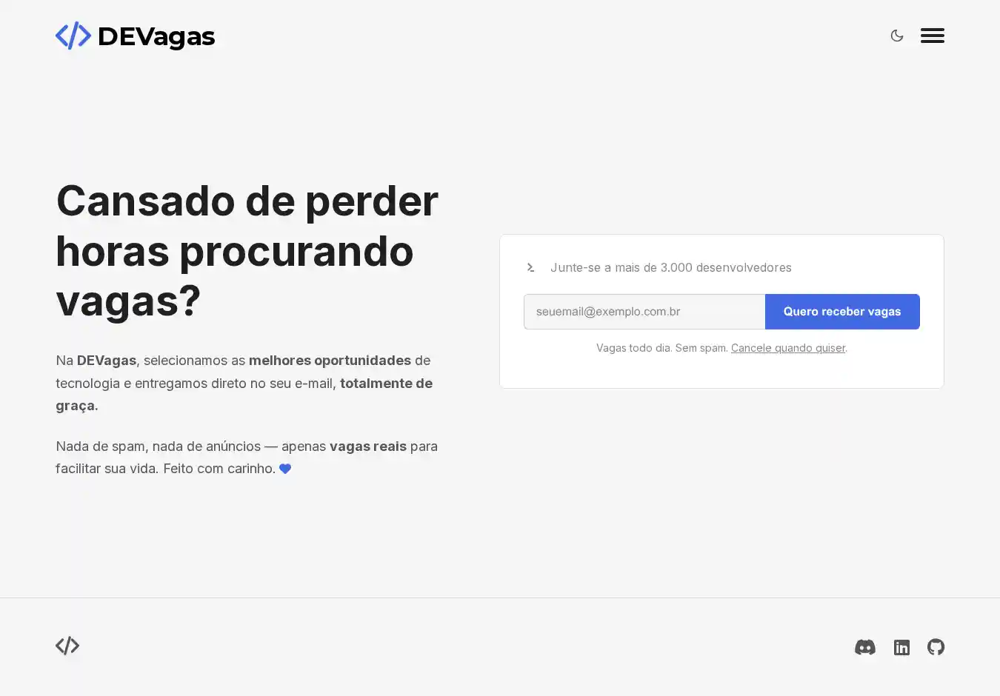

# DEVagas

Newsletter diário de vagas de tecnologia, focada na comunidade de desenvolvedores.

## Pré-visualização

## Funcionalidades

- **Seletor de Tema:** Alternância entre tema claro (light) e escuro (dark).
- **Formulário Funcional:** Integração para captura de e-mails, utilizando uma requisição assíncrona (AJAX).
- **Feedback Visual:** Um modal de sucesso aparece na tela após a inscrição, melhorando a experiência do usuário.
- **Design Responsivo:** A interface se adapta perfeitamente a diferentes tamanhos de tela, de desktops a celulares.

## Tecnologias

- React
- TypeScript
- Vite
- HTML5 & CSS3